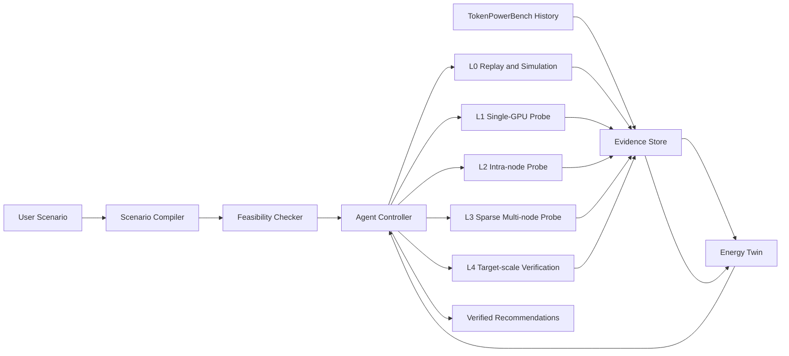

# TokenPowerAgent 完整运行流程

## 1. 核心目标

TokenPowerAgent 的目标不是通过 LLM 直接猜测功耗，也不是使用轻量模拟完全替代真实 GPU 集群，而是：

> 在有限的真实测量预算下，联合使用历史数据、轻量模拟、小规模校准和目标规模验证，找到满足服务等级目标（SLO）的 energy-efficient LLM inference 配置。

对于给定的 inference scenario，系统需要回答三个问题：

1. 哪些候选配置可以通过历史数据或轻量模拟完成初步判断？
2. 哪些候选配置的不确定性足以影响 Pareto ranking 或 SLO 判断，因此需要真实测量？
3. 真实测量应当使用单 GPU、单节点、多节点，还是目标部署规模？

系统优化的不是单一配置，而是以下联合决策：

\[
z=(x,\ell),
\]

其中 \(x\) 是 inference 配置，\(\ell\) 是证据等级 L0-L4。

---

## 2. 输入与输出

### 2.1 输入 Scenario

用户可以通过自然语言或 YAML 提供 inference scenario：

```yaml
model: meta-llama/Llama-3.1-70B
workload:
  trace: longbench
  request_rate: 4.0
  input_tokens: [512, 2048, 8192]
  output_tokens: [128, 512]
hardware:
  gpu: H100-80GB
  nodes: [1, 2]
engine: [vllm, tensorrt_llm]
precision: [fp16, fp8]
parallelism:
  tp: [4, 8, 16]
  pp: [1, 2]
power_cap_w: [450, 600, 700]
slo:
  ttft_ms: 2000
  tpot_ms: 100
budget:
  gpu_hours: 80
  verify_top_k: 3
```

Scenario 主要包含：

- 模型及其架构信息
- Prompt 和生成长度分布
- 请求到达率或请求 trace
- GPU、节点数与网络拓扑
- Inference engine 和软件版本
- Precision、parallelism 和 power policy 搜索空间
- TTFT、TPOT、throughput 等 SLO
- 最大 GPU-hours、最大并发任务数和验证数量

### 2.2 最终输出

TokenPowerAgent 输出：

- 经过 L4 验证的 Top-K 配置
- 每个配置的 energy/token、TTFT、TPOT 和 throughput
- SLO 是否通过以及置信区间
- Pareto frontier 和候选 ranking
- 每个结论对应的 evidence level
- 完整的 simulation、measurement 和 calibration provenance
- 可重复运行的容器、Slurm 或 Ray 配置文件
- Agent 的决策轨迹和测量预算消耗

---

## 3. 系统组成



系统由以下模块组成：

1. **Scenario Compiler**：将自然语言或 YAML 转换为结构化搜索任务。
2. **Feasibility Checker**：检查显存、GPU 数量、TP/PP 组合和 engine 支持情况。
3. **Evidence Store**：保存 TokenPowerBench 历史记录、模拟结果和新测量结果。
4. **Lightweight Sandbox**：执行历史回放、解析模型和离散事件模拟。
5. **Energy Twin**：预测能耗、性能和不确定性。
6. **Agent Controller**：先选择 Explore、ResolveSLO、CalibrateScale、Repair
   或 Verify 语义子目标，再由 IPIG 选择候选配置及其 evidence level。
7. **Executor Abstraction**：`ReplayExecutor` 从隐藏 dense sweep 返回可重复
   evidence；`ClusterExecutor` 使用同一接口生成并执行容器、Ray 或 Slurm 任务。
8. **Verifier**：检查数据质量并完成最终目标规模验证。

---

## 4. Energy Twin

Energy Twin 是一个经过真实测量校准、能够输出不确定性的灰盒模型。

### 4.1 能耗分解

对于 workload \(W\) 和配置 \(x\)，总能耗预测为：

\[
\hat E(W,x)=
\hat E_{\mathrm{idle}}+
\hat E_{\mathrm{prefill}}+
\hat E_{\mathrm{decode}}+
\hat E_{\mathrm{intra}}+
\hat E_{\mathrm{inter}}+
\hat E_{\mathrm{runtime}}.
\]

- \(E_{\mathrm{idle}}\)：模型加载后以及请求间隔的空闲能耗
- \(E_{\mathrm{prefill}}\)：Prompt prefill 的计算和内存能耗
- \(E_{\mathrm{decode}}\)：逐 token decode 和 KV-cache 访问能耗
- \(E_{\mathrm{intra}}\)：PCIe、NVLink、NVSwitch 和节点内 collective 能耗
- \(E_{\mathrm{inter}}\)：跨节点 fabric、同步和 pipeline bubble 能耗
- \(E_{\mathrm{runtime}}\)：Batching、queueing、CPU/DRAM 和调度开销

### 4.2 轻量模型来源

L0 可以组合以下模型：

- TokenPowerBench phase-level lookup surfaces
- Prefill/Decode regression model
- Roofline 或解析计算模型
- KV-cache memory model
- Collective volume 和 topology-aware 通信模型
- \(\alpha\)-\(\beta\) 网络延迟模型
- Vidur-like serving discrete-event simulator
- 从真实测量中学习的 residual model

### 4.3 不确定性

预测必须包含 uncertainty：

\[
U(x)=U_{\mathrm{model}}(x)
+\lambda_h d_h(x,\mathcal D)
+\lambda_s d_s(x,\mathcal D),
\]

其中：

- \(U_{\mathrm{model}}\) 是 ensemble、quantile 或 posterior uncertainty
- \(d_h\) 是新 GPU、网络或 topology 与历史数据的距离
- \(d_s\) 是目标节点数与已测规模的距离

因此，即使模型在单 GPU 上预测准确，当它被外推到四节点时，也必须增加不确定性。

---

## 5. L0-L4 Hierarchical Sandbox

### 5.1 L0：Replay and Simulate

**资源成本：0 GPU。**

主要操作：

1. 从 TokenPowerBench 中检索相似模型、GPU、engine 和 workload。
2. 使用解析或离散事件模型模拟全部可行候选。
3. 预测 energy、TTFT、TPOT 和 throughput。
4. 标记 interpolation、extrapolation 和 topology distance。
5. 删除明显被支配或无法满足 SLO 的候选。

L0 的目标是大范围筛选和发现不确定性，不负责发布最终配置。

### 5.2 L1：Single-GPU Phase Probe

**资源成本：1 GPU。**

测量内容：

- 模型加载和 idle power
- 不同 token bucket 的 Prefill
- Controlled Decode
- FP16、BF16、FP8 或量化策略
- Power cap 和 clock policy
- GPU power、utilization、memory 和 phase timestamp

L1 用来校准计算与内存相关的能耗项。

### 5.3 L2：Intra-node Probe

**资源成本：2-8 GPUs，通常为一个完整节点。**

测量内容：

- TP/PP collective
- NVLink、NVSwitch 或 PCIe 行为
- NCCL collective timing
- 通信与计算 overlap
- 多 GPU KV-cache 压力
- 单节点动态 batching

L2 用来校准节点内并行和通信项。

### 5.4 L3：Sparse Multi-node Probe

**资源成本：2 个或更多节点，但只测试少量候选。**

测量内容：

- 跨节点网络带宽和延迟
- Rank-to-GPU placement
- NCCL fabric collective
- Pipeline bubble 和同步间隔
- 多节点通信与计算 overlap
- Node-level power 和 GPU-level power

L3 不会遍历所有多节点配置。Agent 只选择那些可能改变 Pareto ranking 或 SLO 判断的 scale points。

### 5.5 L4：Target-scale Verification

**资源成本：目标部署规模。**

主要操作：

1. 选择当前 Pareto frontier 上的 Top-K 配置。
2. 使用目标 request trace 和目标并发率运行。
3. 测量完整 energy、latency、throughput 和 SLO。
4. 检查 telemetry 完整性和重复运行稳定性。
5. 只有通过 L4 的配置才能成为最终推荐。

---

## 6. Agent 决策循环

### 6.1 Agent State

每轮决策前，Agent 获取一个结构化状态：

```json
{
  "remaining_gpu_hours": 42.5,
  "candidate_count": 18,
  "current_pareto_candidates": ["cfg_12", "cfg_19", "cfg_24"],
  "highest_uncertainty": ["cfg_19", "cfg_31"],
  "slo_boundary_candidates": ["cfg_12", "cfg_19"],
  "available_resources": {
    "single_gpu": true,
    "full_node": true,
    "multi_node": false
  },
  "failed_jobs": [],
  "verified_candidates": []
}
```

### 6.2 Intent-Conditioned Pareto Information Gain

令 \(\Omega_S\) 表示场景 \(S\) 下随机的高保真 SLO-feasible Pareto set，
action \(a=(x,\ell)\) 同时指定候选配置和证据等级。Agent 使用：

\[
\alpha_t(a\mid S)=
\frac{
I\!\left(Y_a;\Omega_S\mid\mathcal D_t,S\right)
}{
\left(\mathbb E[c(a)\mid\mathcal D_t]+\epsilon\right)^\gamma
}.
\]

- \(I(Y_a;\Omega_S\mid\mathcal D_t,S)\)：观察 action 结果后，对目标规模
  Pareto set 的期望信息增益
- \(c(a)\)：包含排队、失败和 GPU 数量的预计 GPU-hour 成本
- \(\gamma\)：控制探索价值与测量成本之间的权衡
- \(\mathcal D_t\)：当前所有 simulation、probe 和 measurement evidence

语言模型只输出受约束的语义子目标 \(g_t\)，确定性 guard 将 action 限制在
\(\mathcal A(g_t)\) 中，数值策略随后选择：

\[
(x^*,\ell^*)=
\arg\max_{(x,\ell)\in\mathcal A(g_t)}\alpha_t((x,\ell)\mid S).
\]

论文中的完整实现应通过 nested posterior sampling 估计 mutual information；
当前 GitHub scaffold 提供相同接口和透明的 uncertainty proxy，便于先验证完整
控制路径，再替换成精确估计器。

### 6.3 三种 Agent 状态

- **SIMULATE**：候选位于已知数据分布内，轻量模拟已经足够排除或保留它。
- **CALIBRATE**：局部真实测量可能改变 ranking、SLO 判断或 topology uncertainty。
- **VERIFY**：候选即将被推荐，必须进行目标规模验证。

---

## 7. 完整执行步骤

### Step 1：解析 Scenario

1. 将用户自然语言转换成版本化 YAML。
2. 确认目标是最小 energy/token、最小总能耗或多目标优化。
3. 确定 SLO、预算和允许使用的 GPU 资源。

### Step 2：生成并过滤搜索空间

1. 枚举 engine、precision、TP、PP、节点数和 power cap。
2. 使用确定性代码进行显存和拓扑检查。
3. 删除不受 engine 支持或无法部署的配置。

### Step 3：执行 L0

1. 检索相似 TokenPowerBench 记录。
2. 对候选进行 serving 和 energy simulation。
3. 生成均值预测、置信区间和 evidence label。
4. 构造初始 probabilistic Pareto frontier。

### Step 4：建立 Agent State

Agent 聚合：

- 当前候选和 Pareto ranking
- 不确定性最大的候选
- 位于 SLO 边界的候选
- 历史失败任务
- 剩余 GPU-hours
- 当前可用的 GPU 和节点资源

### Step 5：选择 Candidate 和 Evidence Level

1. 由 semantic planner 选择本轮受约束的实验子目标。
2. 为允许的每个 \((x,\ell)\) 估计 IPIG score。
3. 删除超过预算或当前不可执行的 action。
4. 选择 Pareto information gain/GPU-hour 最高的 action。
5. 对 L3/L4 action 请求人工批准或应用预算策略。

### Step 6：执行 Sandbox Job

Sandbox Executor：

1. 从不可变模板生成运行配置。
2. 固定容器、engine、driver 和 telemetry 参数。
3. 提交本地、Ray 或 Slurm 任务。
4. 采集 phase-aligned power、latency 和 communication trace。
5. 保存 stdout、stderr、配置和原始 telemetry。

### Step 7：验证并导入 Evidence

Verifier 检查：

- 任务是否完整结束
- Token 数和请求 trace 是否符合预期
- 是否存在 warmup、OOM 或 scheduler preemption
- Power sample 是否缺失
- 时间戳是否对齐
- GPU、node 和外部 meter 的测量边界是否一致

合格数据写入 Evidence Store；不合格数据被标记为失败证据，不能静默丢弃。

### Step 8：更新 Energy Twin

1. 更新 phase lookup surface 或 residual model。
2. 重新校准 uncertainty interval。
3. 更新 topology 和 scale distance。
4. 重新计算所有候选的 energy、performance 和 Pareto ranking。

### Step 9：判断是否继续

满足以下任一条件时停止 active search：

- GPU-hour 预算耗尽
- 预期 Pareto 变化低于阈值
- SLO-feasible frontier 已稳定
- 所有最终候选都已经获得 L4 支持
- 没有剩余可执行且有价值的 action

### Step 10：L4 最终验证

1. 选择最终 Top-K。
2. 使用目标规模和目标 request trace 重复运行。
3. 将 simulation prediction 与真实 measurement 对比。
4. 过滤未通过 SLO 或测量稳定性检查的候选。

### Step 11：生成最终报告

最终报告必须区分：

- **simulated**：只由 L0 支持
- **interpolated**：位于已测配置之间
- **extrapolated**：跨 GPU、topology 或 node count 外推
- **measured**：具有 L1-L4 telemetry
- **verified**：通过目标规模 L4 测量

---

## 8. 伪代码

```text
Input:
    scenario S
    historical evidence D0
    real-measurement budget B

X = compile_and_validate(S)
Twin = fit_energy_twin(D0, S)
Bs, Bv = reserve_target_scale_verification(B)

while Bs > 0:
    predictions, uncertainty = Twin.predict(X)
    pareto_set = probabilistic_pareto(predictions, uncertainty, S.slo)
    subgoal = semantic_plan(S, Twin, D0, Bs)

    actions = []
    for candidate x in X:
        for level l in available_levels(x):
            if guard_allows(subgoal, x, l, Bs):
                score = ipig(x, l, Twin, pareto_set, D0)
                actions.append((score, x, l))

    score, x_star, l_star = select_best_action(actions)

    if score < stopping_threshold:
        break

    evidence = sandbox.acquire(x_star, l_star)
    evidence = verifier.validate(evidence)
    evidence_store.append(evidence)

    Bs = Bs - evidence.actual_gpu_hours
    Twin.update(evidence)

verified_set = verify_top_k(pareto_set, level="L4", budget=Bv)
return verified_set, provenance, runnable_configs
```

---

## 9. LLM 与确定性模块的职责边界

### 9.1 LLM 可以负责

- 理解自然语言 scenario
- 调用受约束的工具
- 根据结构化状态制定实验计划
- 解释为什么选择某个 evidence level
- 对失败任务提出修复 action
- 生成用户可读的报告

### 9.2 LLM 不应负责

- 直接计算能耗或通信时间
- 自行判断显存是否足够
- 在自然语言中完成 Pareto sorting
- 修改测量数据
- 不经批准扩大 Slurm allocation
- 将模拟结果表述为真实测量

以下工作应由确定性代码执行：

- 数值预测和单位转换
- Feasibility checking
- Pareto frontier 计算
- Acquisition score
- GPU-hour accounting
- Telemetry validation
- Evidence labeling

---

## 10. 失败处理

系统需要区分：

- Out of memory
- Engine initialization failure
- Scheduler preemption
- NCCL or network failure
- Telemetry loss
- Request trace mismatch
- SLO failure
- Agent planning failure

失败任务也应写入 Evidence Store。它们可以更新 feasibility 或 failure model，但不能被当作有效能耗测量。

当配置发生修复时，例如从 TP=8 改为 TP=16，必须创建新的 configuration hash，不能覆盖原任务。

---

## 11. 端到端示例

目标：为 Llama-3.1-70B、长上下文、两节点 H100 部署选择满足 TPOT SLO 的最低能耗配置。

1. Scenario Compiler 生成 FP16/FP8、TP=8/16、PP=1/2 和多个 power cap 候选。
2. Feasibility Checker 删除显存不足和不受支持的组合。
3. L0 检索 TokenPowerBench 中的 70B/H100 记录并模拟全部候选。
4. 多数高能耗配置被删除，但 TP=8 和 TP=16 的置信区间重叠。
5. TP=8 接近 TPOT 边界，且跨节点通信项不确定。
6. Agent 选择 L2 TP collective probe，而不是直接运行完整两节点 workload。
7. L2 数据校准节点内通信，但仍无法确定跨节点 fabric 开销。
8. Agent 选择一个稀疏 L3 两节点 probe，测量 NCCL、placement 和 overlap。
9. Energy Twin 更新后，TP=16/FP8/600W 成为稳定的 Pareto 候选。
10. Agent 对 Top-3 候选执行 L4 request-trace replay。
11. 最终只推荐通过能耗、TPOT、TTFT 和稳定性检查的配置。

该流程的研究价值不在于预测某个单独功耗值，而在于证明 Agent 能够避免对所有候选执行昂贵的两节点测量。

---

## 12. 最小可行实现路线

### Phase A：零 GPU MVP

- 导入 TokenPowerBench JSON/telemetry summary
- 实现 Scenario Compiler 和 Feasibility Checker
- 实现 L0 phase lookup 和简单 serving simulator
- 实现 Energy Twin prediction API
- 实现 Pareto、semantic subgoal 和 IPIG loop

### Phase B：单 GPU Agent

- 接入 L1 probe
- 自动生成 TokenPowerBench 运行配置
- 采集并验证 NVML/DCGM telemetry
- 使用真实测量更新 Energy Twin

### Phase C：单节点多 GPU

- 接入 L2 NCCL/TP/PP probe
- 建立节点内 topology model
- 增加动态 batching 和 KV-cache 测试

### Phase D：稀疏多节点与最终验证

- 接入 Slurm/Ray 多节点执行器
- 实现 L3 sparse calibration policy
- 实现 L4 target-trace verifier
- 输出完整 artifact 和实验 provenance

---

## 13. 需要验证的核心假设

论文最终应验证：

1. Energy Twin 是否能在不同 workload 和 node count 上保持合理的 prediction interval coverage？
2. L1/L2/L3 稀疏校准是否能显著降低跨规模预测误差？
3. 在相同 GPU-hour 预算下，TokenPowerAgent 是否比 random search、Bayesian optimization 和 simulator-only search 找到更好的 Pareto frontier？
4. TokenPowerAgent 是否可以减少达到固定 Pareto regret 所需的真实测量数量？
5. L4 验证是否能阻止错误的 simulation/extrapolation recommendation 被发布？

最核心的评价坐标应当是：

\[
\text{Pareto quality or regret}
\quad \text{versus} \quad
\text{cumulative real GPU-hours}.
\]

这直接衡量 Agent 是否比现有方法更有效地使用真实测量预算。
